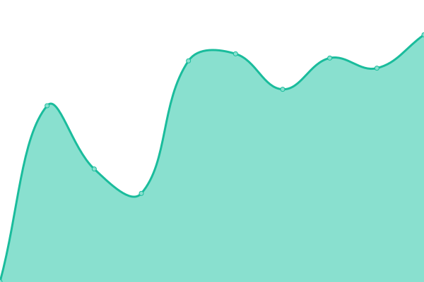
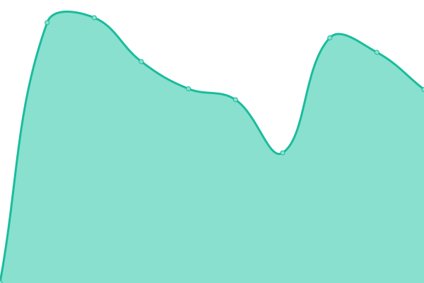

# [📈 Live Status](https://froggie3.github.io/upptime): <!--live status--> **🟧 Partial outage**

This repository contains the open-source uptime monitor and status page for [Yokkin](https://yokkin.com/), powered by [Upptime](https://github.com/upptime/upptime).

With [Upptime](https://upptime.js.org), you can get your own unlimited and free uptime monitor and status page, powered entirely by a GitHub repository. We use [Issues](https://github.com/froggie3/upptime/issues) as incident reports, [Actions](https://github.com/froggie3/upptime/actions) as uptime monitors, and [Pages](https://froggie3.github.io/upptime) for the status page.

<!--start: status pages-->
<!-- This summary is generated by Upptime (https://github.com/upptime/upptime) -->
<!-- Do not edit this manually, your changes will be overwritten -->
<!-- prettier-ignore -->
| URL | Status | History | Response Time | Uptime |
| --- | ------ | ------- | ------------- | ------ |
|  [yokkin.com](https://yokkin.com) | 🟩 Up | [yokkin-com.yml](https://github.com/froggie3/upptime/commits/HEAD/history/yokkin-com.yml) | 

 854ms
     
 | 

<a href="https://froggie3.github.io/upptime/history/yokkin-com">100.00%</a>
    

|  [iigau lab](https://akkoma.yokkin.com) | 🟥 Down | [iigau-lab.yml](https://github.com/froggie3/upptime/commits/HEAD/history/iigau-lab.yml) | 

 574ms
     
 | 

<a href="https://froggie3.github.io/upptime/history/iigau-lab">98.70%</a>
    

|  [sanctunes](https://sanctunes.yokkin.com) | 🟩 Up | [sanctunes.yml](https://github.com/froggie3/upptime/commits/HEAD/history/sanctunes.yml) | 

 630ms
     
 | 

<a href="https://froggie3.github.io/upptime/history/sanctunes">100.00%</a>
    

<!--end: status pages-->

[**Visit our status website →**](https://froggie3.github.io/upptime)

## 📄 License

- Powered by: [Upptime](https://github.com/upptime/upptime)
- Code: [MIT](./LICENSE) © [Anand Chowdhary](https://anandchowdhary.com), supported by [Pabio](https://pabio.com)
- Data in the `./history` directory: [Open Database License](https://opendatacommons.org/licenses/odbl/1-0/)
